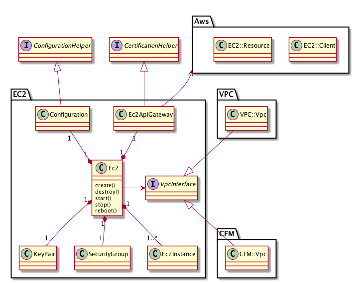

EC2
---

## 基本仕様
+ VPCで作成されたネットワークにインスタンスを作成する。
+ 対応するパターンは[７パターン](../vpc/vpc.md)
+ すべてのインスタンスに共通のセキュリティグループが適用される。
+ すべてのインスタンスに共通のキーペアが適用される。
+ シンプルなVPC環境はパターン１に対応する。
+ 標準的なVPC環境はパターン３に対応する。

## ユースケース
### パターン1

### パターン2

### パターン3

### パターン4

### パターン5

### パターン6

### パターン7

## コアモデル
