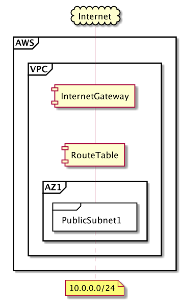
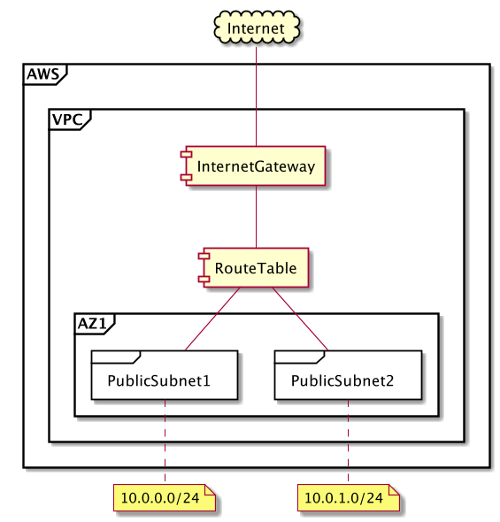
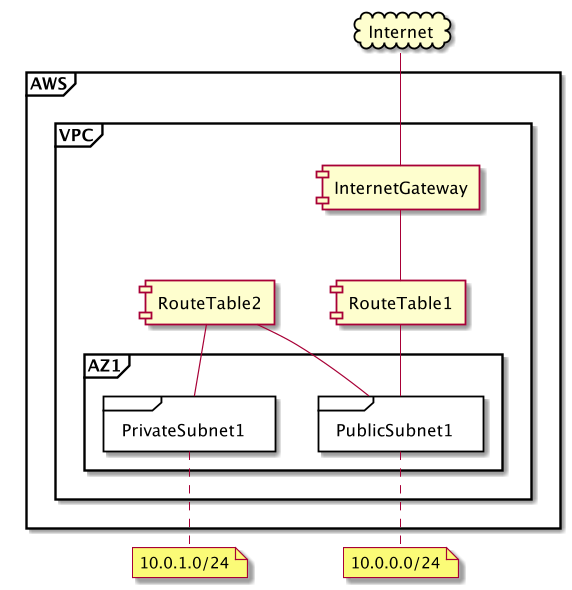
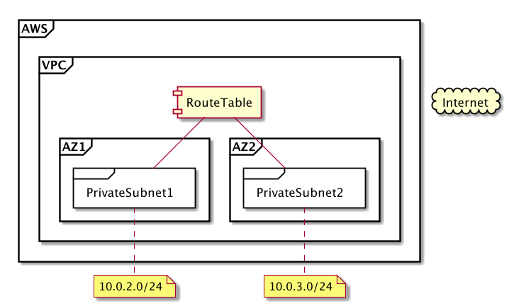
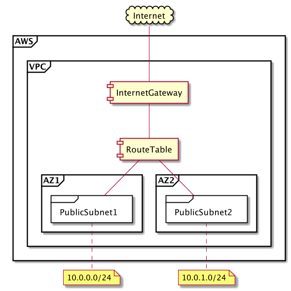
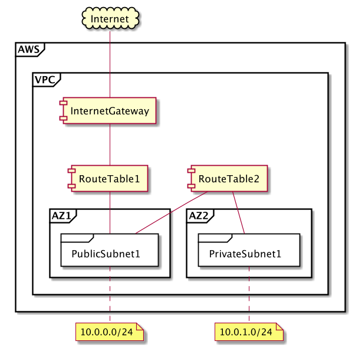
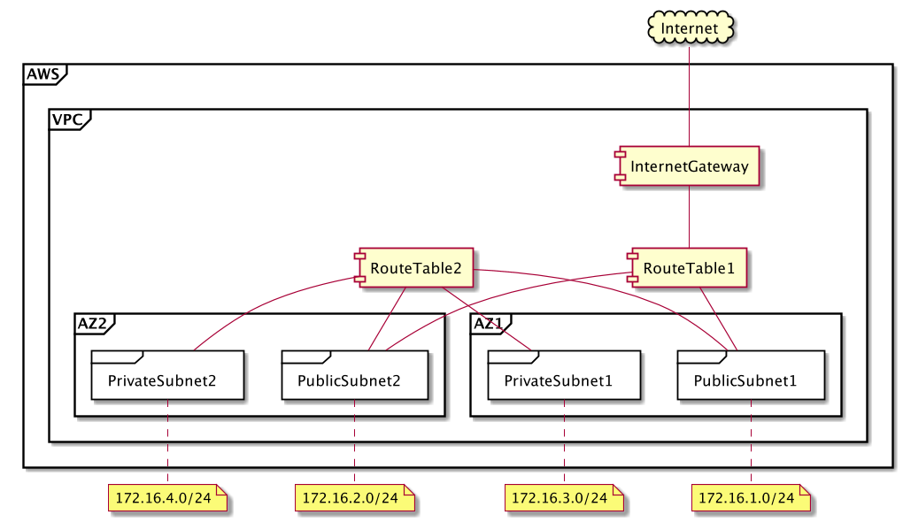
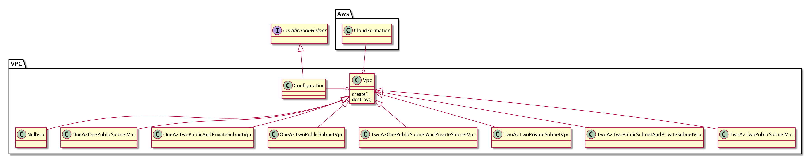

VPC
---

## 基本仕様
+ CloudFormationのテンプレートファイルに記述されたパターンごとにVPC環境を構築する
+ 7パターンに対応する
  1. １つのアベイラビリティゾーンに１つのパブリックサブネット
  1. １つのアベイラビリティゾーンに２つのパブリックサブネット
  1. １つのアベイラビリティゾーンに１つのパブリックサブネットと１つのプライベートサブネット
  1. ２つのアベイラビリティゾーンに２つのプライベートサブネット
  1. ２つのアベイラビリティゾーンに２つのパブリックサブネット
  1. ２つのアベイラビリティゾーンに１つのパブリックサブネットと１つのプライベートサブネット
  1. ２つのアベイラビリティゾーンに２つのパブリックサブネットと２つのプライベートサブネット

## ユースケース
### パターン1

### パターン2

### パターン3

### パターン4

### パターン5

### パターン6

### パターン7

## コアモデル
