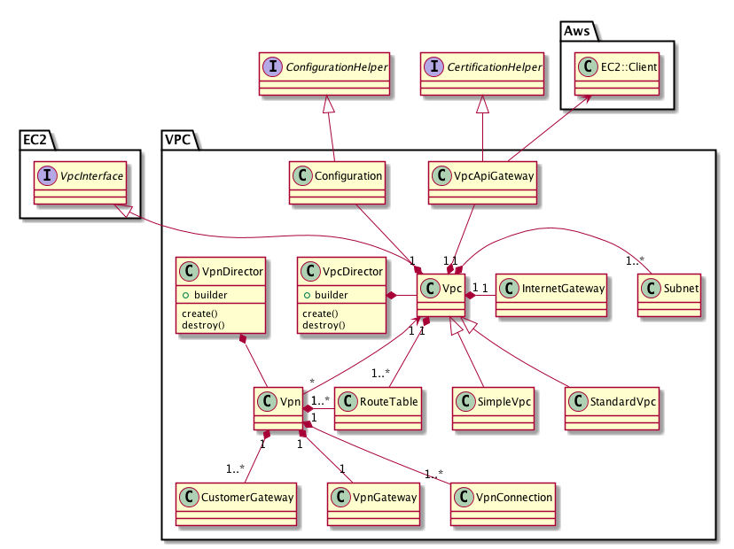

VPC
---

## 基本仕様
+ １つのVPCに対して複数のサブネットを持つ
+ １つのVPCに対して複数のルートテーブルを持つ
+ １つのVPCに対して１つのインターネットゲートウェイを持つ
+ インターネットゲートウェイを持つルートテーブルに関連付けられてたサブネットはパブリックとなる
+ インターネットゲートウェイを持たないルートテーブルに関連付けられてたサブネットはプライベートとなる

## ユースケース
### シンプルなVPC

### 標準的なVPC

## コアモデル
